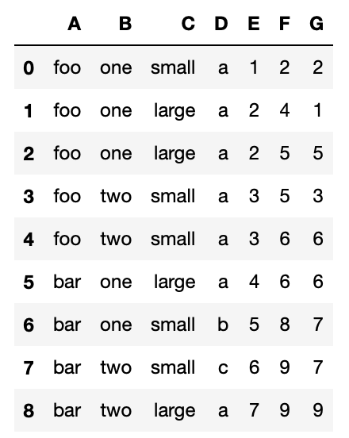
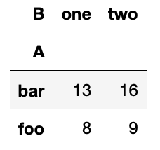

# PL Element for Data 100

This repository represents our work on a new element designed for use as a formative assessment tool, evaluating students' proficiency in pivot table operations in Data 100 and similar data science courses. Pivot table transformations have often been considered one of the more challenging concepts in data science to master, highlighting the need for an innovative approach to practice and assess these concepts. Our design philosophy for this element is based on the Mastery Learning model developed by Professors Dan Garcia and Armando Fox, which can be found at this [link](https://doi.org/10.1145/3491140.3528289).

In contrast to traditional paper-based or JupyterHub assignments, our new element incorporates randomization, drag-and-drop functionality, and provides instant feedback and grading. This approach enables students to practice various versions of the same concept and gain insights into their knowledge gaps. We conducted a pilot study to measure the effectiveness of this assignment, which demonstrated that introductory data science students found our element more intuitive than the JupyterHub version. They also expressed a preference for practicing pivot table transformations using our element as opposed to JupyterHub. We are optimistic about implementing a larger-scale study to comprehensively evaluate the effectiveness and scalability of our element.

## What Does This Element Do?

1. `pl-pivot-table` helps instructors create questions for Pandas pivot table operation practice.
2. Students can drag and drop elements from the provided row, column, and index sets to complete the dataframe, similar to building code in Parsons' Problems.

## Slide Deck (Basic Plan and Idea of This Project)

You can find more details about our project in this [slide deck](https://docs.google.com/presentation/d/1K6x-VDJGsnKooS1rQ43vHO1SW6SUSoAYT_lzCyHY5l8/edit#slide=id.g2808ed675f2_1_10).

## How Can I Author a Question?

We provide a few examples: one question for a single-indexed dataframe and the other for a double-indexed dataframe. We will use the following dataframe as a basis for all tutorials:

```python
df = pd.DataFrame({"A": ["foo", "foo", "foo", "foo", "foo",
                         "bar", "bar", "bar", "bar"],
                   "B": ["one", "one", "one", "two", "two",
                         "one", "one", "two", "two"],
                   "C": ["small", "large", "large", "small",
                         "small", "large", "small", "small",
                         "large"],
                   "D":["a","a","a","a","a","a","b","c","a"],
                   "E": [1, 2, 2, 3, 3, 4, 5, 6, 7],
                   "F": [2, 4, 5, 5, 6, 6, 8, 9, 9],
                   "G": [2, 1, 5, 3, 6, 6, 7, 7, 9]})
```



### Example of a Single-Indexed Dataframe

Let's create a question for this syntax:

```python
df.pivot_table(index='A', columns='B', values='G', aggfunc='sum')
```

The dataframe after the operation i.e. the answer to the question will look like this:



Below is the HTML code for this question (questions/pivot-table_question1):

```html
<pl-dataframe params-name="df" show-index="true" show-dimensions="false" digits="4"></pl-dataframe>
<p>What will the dataframe "df" look like after the pivot? Drag and drop your answer below.</p>
<pl-code language="python"> df.pivot_table(index='A', columns='B', values='G', aggfunc='sum') </pl-code>
<pl-pivot-table col="3" row="2" index="1" multi-col="false" ellipsis="false">
    <pl-column>
        <pl-choice correct="false">B two one</pl-choice>
        <pl-choice correct="false">B sum sum</pl-choice>
        <pl-choice correct="true">B one two</pl-choice>
        <pl-choice correct="false">B two two</pl-choice>
    </pl-column>
    <pl-index>
        <pl-choice correct="false">A bar &nbsp;</pl-choice>
        <pl-choice correct="false">A one two</pl-choice>
        <pl-choice correct="true">A bar foo</pl-choice>
        <pl-choice correct="false">B two one</pl-choice>
    </pl-index>
    <pl-row>
        <pl-choice correct="true" place="1">13 8</pl-choice>
        <pl-choice correct="false">4.0 7.0</pl-choice>
        <pl-choice correct="true" place="2">16 9</pl-choice>
        <pl-choice correct="false">7.0 3</pl-choice>
    </pl-row>
</pl-pivot-table>
```

### pl-dataframe

`pl-dataframe` is a built-in PL element. We use this to visualize our dataframe, but feel free to use other elements that are more suitable.

### pl-code

`pl-code` is also for question information and is a built-in PL element.

### pl-pivot-table

There are 5 attributes for this element: col, row, index, multi-col, ellipsis.

1. col: the number of columns in the final pivoted table.
2. row: the number of rows that will be the final pivoted table.
3. index: the number of the indices in the final pivoted table.
4. multi-col: set to `true` if the pivot is on two columns, set to `false` otherwise
5. ellipsis: truncates column and row pieces ellipsis if they become too long,

Building `pl-pivot-table` requires the usage of `pl-column`, `pl-index`, and `pl-row`.

### pl-column  

`pl-column` delineates column choices in the column box. Each choice is represented by `pl-choice` and each space-separated value within `pl-choice` ("B," "two," "one") represents one value in that row of columns. The `correct` attribute indicates whether the choice is correct or not.

```html
<pl-column>
    <pl-choice correct="false">B two one</pl-choice>
    <pl-choice correct="false">B sum sum</pl-choice>
    <pl-choice correct="true">B one two</pl-choice>
    <pl-choice correct="false">B two two</pl-choice>
</pl-column>
```

### pl-index  

`pl-row` delineates index choices in the index box. Each choice is represented by `pl-choice` and each space-separated value within `pl-choice` ("A," "bar," "foo") represents one value in that column of indices. Again, the `correct` attribute indicates whether the choice is correct or not.

```html
<pl-index>
    <pl-choice correct="false">A bar &nbsp;</pl-choice>
    <pl-choice correct="false">A one two</pl-choice>
    <pl-choice correct="true">A bar foo</pl-choice>
    <pl-choice correct="false">B two one</pl-choice>
</pl-index>
```

### pl-row

`pl-row` represents row choices for values in the row box. It is somewhat different from the above two as students have to drag more than one row to solve the problem. To set the answer of the rows you need to set not only the `correct` field, but also the `place` field which represents the ordering of the choice from top to bottom, starting from 1.

```html
<pl-row>
    <pl-choice correct="true" place="1">13 8</pl-choice>
    <pl-choice correct="false">4.0 7.0</pl-choice>
    <pl-choice correct="true" place="2">16 9</pl-choice>
    <pl-choice correct="false">7.0 3</pl-choice>
</pl-row>
```

### Example of multi-column

To create a question for operations like this example:

```html
table = pd.pivot_table(df, values=['E', 'F','G'], index=['A'],
                       aggfunc={'E': "mean",
                                'F': ["min", "max", "mean"],
                                'G': np.median})
```

we must account for the for the multiple columns in the resulting pivot table. Setting the `multi-col` attribute to true will get you two different dropzones for columns. You also need to set two correct choices for the column dropzones, similar to pl-row, like below:

```html
<pl-column>
    <pl-choice correct="true" place="1">&nbsp; E F &nbsp; &nbsp; G</pl-choice>
    <pl-choice correct="false">&nbsp; F G &nbsp; &nbsp; A</pl-choice>
    <pl-choice correct="false">&nbsp; E A &nbsp; &nbsp; G</pl-choice>
    <pl-choice correct="true" place="2">&nbsp; mean max mean min median</pl-choice>
    <pl-choice correct="false">&nbsp; min max mean min mean</pl-choice>
</pl-column>
```

### How to customize column box, index box, or row box?
Simply add an attribute "label" in the tag and the value of the attribute will be new name for your box. If you don't add any attribute on the tag, then it will show you default name for the box.
```html
<pl-column label="TYPE YOUR CUSTOM LABEL">
    <pl-choice correct="true" place="1">&nbsp; E F &nbsp; &nbsp; G</pl-choice>
    <pl-choice correct="false">&nbsp; F G &nbsp; &nbsp; A</pl-choice>
    <pl-choice correct="false">&nbsp; E A &nbsp; &nbsp; G</pl-choice>
    <pl-choice correct="true" place="2">&nbsp; mean max mean min median</pl-choice>
    <pl-choice correct="false">&nbsp; min max mean min mean</pl-choice>
</pl-column>
```

### How about dropzone?
Name of dropzone can be customized by adding an attribute "dropzone".  
```html
<pl-pivot-table col="3" row="2" index="1" multi-col="false" ellipsis="false" dropzone="TYPE YOUR CUSTOM NAME">
```

### More examples?

We have included four different patterns of questions in the Data100 questions folder: single-indexed and single column, single-indexed and multi-column, double-indexed and single column, double-indexed and multi-column.
