#  What does this element do?
## 1. pl-plvot-table helps instructor to write questions for pandas pivot table operation practice.  
## 2. Students will drag and drop from row, column, and index set provided to complete the dataframe. In other words, students will assemble dataframe like building lego block.  


# Slide deck(Basic plan and idea of this project)
https://docs.google.com/presentation/d/1K6x-VDJGsnKooS1rQ43vHO1SW6SUSoAYT_lzCyHY5l8/edit#slide=id.g2808ed675f2_1_10

# How can I author question?
Here, we will create two questions with fews example: One question for single index dataframe, and the other for double-index dataframe.  
**We will walk through ALL tutorials using below dataframe**
```
df = pd.DataFrame({"A": ["foo", "foo", "foo", "foo", "foo",
                         "bar", "bar", "bar", "bar"],
                   "B": ["one", "one", "one", "two", "two",
                         "one", "one", "two", "two"],
                   "C": ["small", "large", "large", "small",
                         "small", "large", "small", "small",
                         "large"],
                   "D":["a","a","a","a","a","a","b","c","a"],
                   "E": [1, 2, 2, 3, 3, 4, 5, 6, 7],
                   "F": [2, 4, 5, 5, 6, 6, 8, 9, 9],
                   "G": [2, 1, 5, 3, 6, 6, 7, 7, 9]})
```
  

### Example of single index dataframe:

Let's create a question for this syntax  
```
df.pivot_table(index='A', columns='B', values='G', aggfunc='sum')
```
<br />
<br />
Dataframe after this operation will look like this. That is, this will be answer studets should put together:  
  
<br />
<br />

Below is question.html of this question(questions/pivot-table_question1).
```
<pl-dataframe params-name="df" show-index="true" show-dimensions="false" digits="4"></pl-dataframe>
<p>What will dataframe "df" looks like after pivot? Drag and drop your answer below</p>
<pl-code language="python"> df.pivot_table(index='A', columns='B', values='G', aggfunc='sum') </pl-code>
<pl-pivot-table col="3" row="2" index="1" multi-col="false" ellipsis="false">
    <pl-column>
        <pl-choice correct="false">B two one</pl-choice>
        <pl-choice correct="false">B sum sum</pl-choice>
        <pl-choice correct="true">B one two</pl-choice>
        <pl-choice correct="false">B two two</pl-choice>
    </pl-column>
    <pl-index>
        <pl-choice correct="false">A bar &nbsp;</pl-choice>
        <pl-choice correct="false">A one two</pl-choice>
        <pl-choice correct="true">A bar foo</pl-choice>
        <pl-choice correct="false">B two one</pl-choice>
    </pl-index>
    <pl-row>
        <pl-choice correct="true" place="1">13 8</pl-choice>
        <pl-choice correct="false">4.0 7.0</pl-choice>
        <pl-choice correct="true" place="2">16 9</pl-choice>
        <pl-choice correct="false">7.0 3</pl-choice>
    </pl-row>
</pl-pivot-table>
<pl-dataframe params-name="df" show-index="true" show-dimensions="false" digits="4"></pl-dataframe>
<p>What will dataframe "df" looks like after pivot? Drag and drop your answer below</p>
<pl-code language="python"> df.pivot_table(index='A', columns='B', values='G', aggfunc='sum') </pl-code>
<pl-pivot-table col="3" row="2" index="1" multi-col="false" ellipsis="false">
    <pl-column>
        <pl-choice correct="false">B two one</pl-choice>
        <pl-choice correct="false">B sum sum</pl-choice>
        <pl-choice correct="true">B one two</pl-choice>
        <pl-choice correct="false">B two two</pl-choice>
    </pl-column>
    <pl-index>
        <pl-choice correct="false">A bar &nbsp;</pl-choice>
        <pl-choice correct="false">A one two</pl-choice>
        <pl-choice correct="true">A bar foo</pl-choice>
        <pl-choice correct="false">B two one</pl-choice>
    </pl-index>
    <pl-row>
        <pl-choice correct="true" place="1">13 8</pl-choice>
        <pl-choice correct="false">4.0 7.0</pl-choice>
        <pl-choice correct="true" place="2">16 9</pl-choice>
        <pl-choice correct="false">7.0 3</pl-choice>
    </pl-row>
</pl-pivot-table>
```
<br />
<br />
<br />

### pl-dataframe
pl-dataframe is built in PL element. I used this element to give clear direction, but if there is any better way other than pl-dataframe, feel free to use it!
### pl-code
pl-code is also for direction and built in PL element
### pl-pivot-table
This is an element we are going to learn about. There are 5 attibutes for this element: col, row, index, multi-col, ellipsis.<br />

1. col  
col attribute helps you set the number of column. In this example, it's set to 3.  
This attribute will affect the total number of cells in column choice, and the total number of places for column dropzone. Max value of this attribute is 6 since more than 6 columns are easily garbled in the screen.<br />

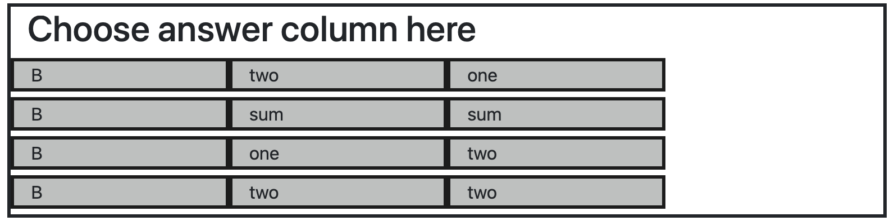<br />
Take a look each column in the set has three cells<br />
<br />
<br />
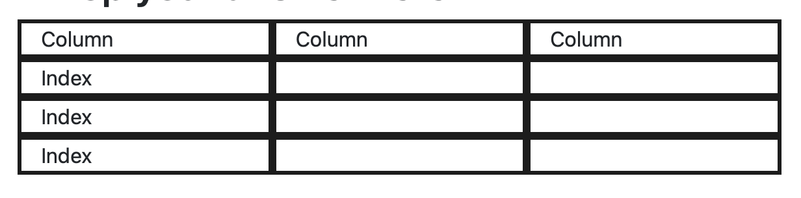<br />
Take a look column dropzone has three places to drop one of choices in the set<br />
<br />
<br />
2. row  
row attribute has the same function with the col attribute. Max possible value is also the same. However, the way number of rows in dropzone counted is different than column. I will explain why.<br />

Let's take a look of the answer dataframe(printed on Jupyter notebook) again.<br />
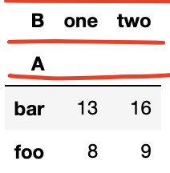<br />
You will notice that there are some gaps between the starting point of row and column. In other words, two more virtual rows will be needed to draw dataframe. Thus, the total number of rows in dropzone will have 2 rows(virtual rows) more than the value you acutally entered<br />
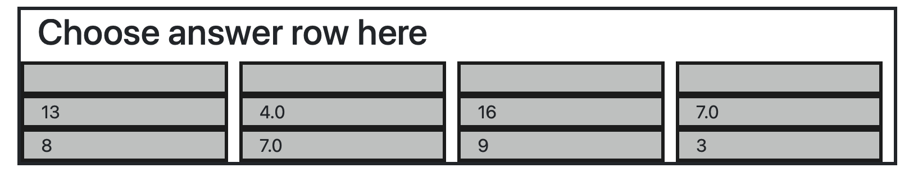<br />
Due to the same reason, you will see one more row in row choices. Why there aren't more than 2 virtual rows in the choice? This is because column set took over the place at the top of row. In other words, that virtual place at the top of each choice will be place for column.<br />
<br />
3. index  
index attribute is for setting number of index. In this example, we are making single index question. Thus, we will go over it later. For the being time, it will be enough to know index attribute can be assigned only two values(1 or 2). The reason why I didn't make triple index is it's not common to see triple index. However, I'm planning to expand the maximum value of index attribute in future  
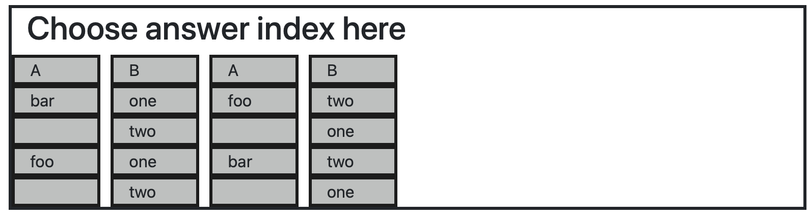  
This will be index set you will see when you set this attribute to 2. You might have noticed that the width of index choice is narrower  
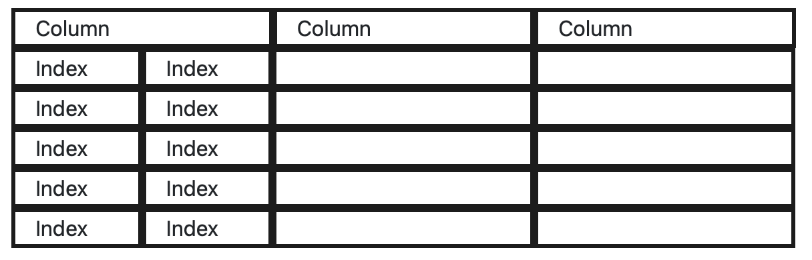  
This will be dropzone you will see when you set this attribute to 2.  
4. multi-col  
This attribute will be explained at next example. For now, just keep in mind that this attribute takes boolean  

5. ellipsis
ellipsis attribute is made to overcome limitation of screensize and max number of col and row atrribute. When dataframe gets bigger, it will be impossible to draw all the cells in one screen. Ellipsis will add ellipsis at the end of column and row. However, some authors may prefer to type ellipsis by hand instead of setting attribute once. Thus, this attribute can be changed after feedbacks from TAs, instructors, or anyone who is interested in this element.  
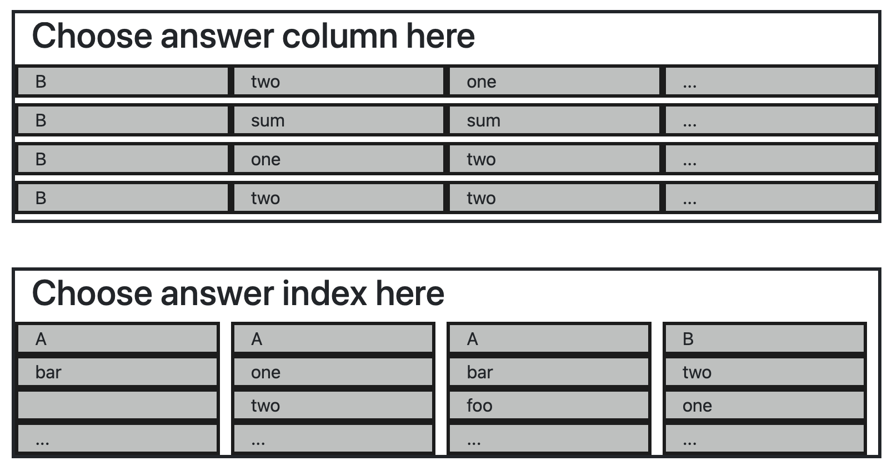  
```
<pl-pivot-table col="4" row="3" index="1" multi-col="false" ellipsis="true">
```
This is how columns and rows choices look like when ellipsis is set to true. Also, adding ellipsis means there will be one more place for column and row. Thus, you should plus one on each col and row attribute. In this example, each col and row should be 4 and 3. Otherwise, PL will pop up error message.

Now, let break down **pl-column**, **pl-index**, and **pl-row**. Each element creats column choices, index choices, and row choices in the set. I will explain it further.  

### pl-column  
```
<pl-column>
    <pl-choice correct="false">B two one</pl-choice>
    <pl-choice correct="false">B sum sum</pl-choice>
    <pl-choice correct="true">B one two</pl-choice>
    <pl-choice correct="false">B two two</pl-choice>
</pl-column>
```
Assume you want to makes a choice in columns set that something like below:  
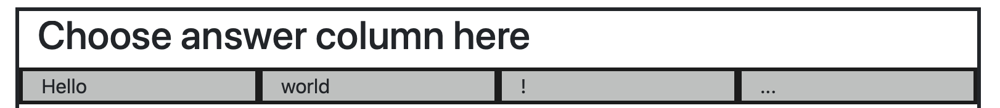  
Then, you may want to do like this:  
```
<pl-choice correct="false">Hello world !</pl-choice>
```
Each contiguous string("Hello", "world", "!") is stored in each cell, and space between strings will distinguish which one is which. But, what if I want to store space in the string? In that case, use indicator \s inside string. So, If you want something like...  
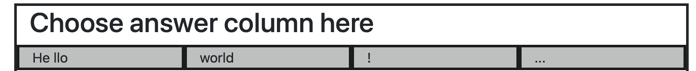  
What you want to do will be...:  
```
<pl-choice correct="false">He\sllo world !</pl-choice>
```
Now, I will explain "correct" attribute of column. correct attribute is for setting the correct choice among the set. In this example, it's set to third one. Also, you can set more than one column as possible answer.  

### pl-index  
```
<pl-index>
    <pl-choice correct="false">A bar &nbsp;</pl-choice>
    <pl-choice correct="false">A one two</pl-choice>
    <pl-choice correct="true">A bar foo</pl-choice>
    <pl-choice correct="false">B two one</pl-choice>
</pl-index>
```
pl-index works pretty similar with pl-column. One difference is if you want to keep certain cell empty. Use &nbsp; instead of \s. This is because string parsing logic behind the element. If you use \s, then the shape of index chices will be garbled.

### pl-row
```
<pl-row>
    <pl-choice correct="true" place="1">13 8</pl-choice>
    <pl-choice correct="false">4.0 7.0</pl-choice>
    <pl-choice correct="true" place="2">16 9</pl-choice>
    <pl-choice correct="false">7.0 3</pl-choice>
</pl-row>
```
pl-row is a little bit different since students have to drag more than one row to solve problem. To set the answer of row, first, you need to set correct attribute of answer choices. In this example, it's first one and third one. After then, you need to set which place the choice should be dropped between 1 to n(depending on what value you set for col attribute).  
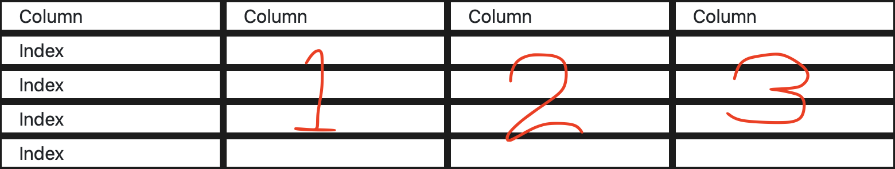  
The picture shows you numbering of dropzone. If you set col attribute to 6, then you will see more row dropzones and it will end at 6.  

### Example of double index dataframe:
Now, we want to creat a question for this operation.
```
table = pd.pivot_table(df, values=['E', 'F','G'], index=['A'],
                       aggfunc={'E': "mean",
                                'F': ["min", "max", "mean"],
                                'G': np.median})
```
<br />
<br />

Take a look at the answer of the dataframe. Did you notice some difference?  
The column place is layered. That is...<br />
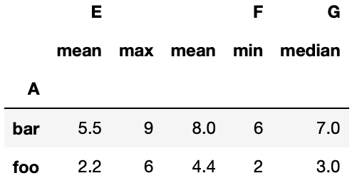  
  
Now compare two dataframe below  
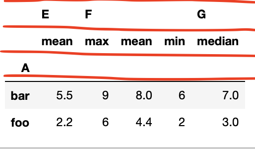  
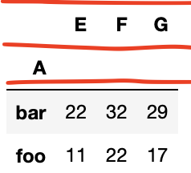  
The first one is the result of below operation, and the second one is result of an operation with aggfunc='sum' and same values for other arguments.  
Thus, to address this issue, multi-col attribute is made. When you set this attribute to true, you will get two different dropzones for columns  
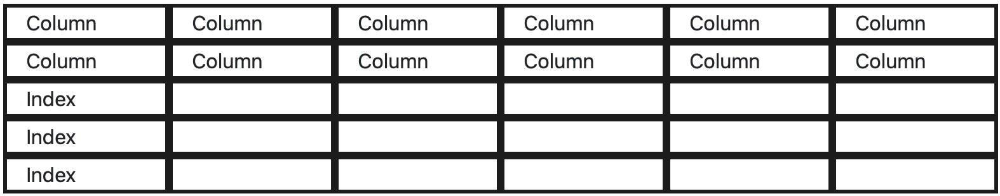  
After multi-col sets to true, you also need to set two answers for column dropzones. This is similar to pl-row. What you will want to do will be like below:  
```
<pl-column>
    <pl-choice correct="true" place="1">&nbsp; E F &nbsp; &nbsp; G</pl-choice>
    <pl-choice correct="false">&nbsp; F G &nbsp; &nbsp; A</pl-choice>
    <pl-choice correct="false">&nbsp; E A &nbsp; &nbsp; G</pl-choice>
    <pl-choice correct="true" place="2">&nbsp; mean max mean min median</pl-choice>
    <pl-choice correct="false">&nbsp; min max mean min mean</pl-choice>
</pl-column>
```
As you can see, there are two choices with correct attribute true and place attribute with number 1 and 2. Place 1 is the top of the column dropzone and place is the bottom of the dropzone

# More examples?
I made more examples at the folder to refer.
